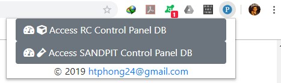

# chrome-ext-boa-control-panel
Chrome extension for boa control panel to open commonly used connections easier.

The extension will inject 4 buttons below to the ledger details page and ledger's DB details page (for security reasons, there will be no screen-shots for these 4 buttons).

+ Access LEDGER DB with support acc
+ Access LEDGER DB with boa_xxx acc
+ Access Ledger's AUTHENTICATION DB
+ Retrieve LEDGER DB boa_xxx acc

In addition to those buttons, the extension popup page also has 2 other buttons as below.

+ Access RC Control Panel DB
+ Access SANDPIT Control Panel DB



All buttons' name are self-explanatory.

## Steps to setup the extension

1. **Clone the application**

    ```bash
    git clone https://github.com/htphong24/chrome-ext-boa-control-panel.git
    ```

2. **Change connection strings**

    + Open `host/CustomConnectionStrings.config` file.
    + Change connectionString for RC and Sandpit DBs

3. **Install host**

    + Run `host/install_host.bat` to install native messaging app

4. **Install chrome extension**

    + Enable Developer mode (More tools > Extensions > Developer mode)
    + Load the unpacked folder (chrome-ext-boa-control-panel)

## Notes

+ The extension currently uses fixed ID (`kobhnjaailplkhikcgljikmfikkmogke`) to make the installation easier.
+ The source code for host (native messaging app) can be found [here](https://github.com/htphong24/boa-control-panel-extension-console-app). It is being made private due to security reasons.
+ To disable host's logging, open `host/boa-control-panel-extension-console-app.exe.config` and change log4net's threshold to `OFF`.
